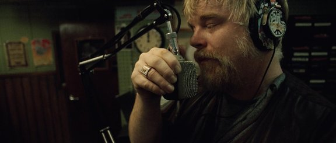
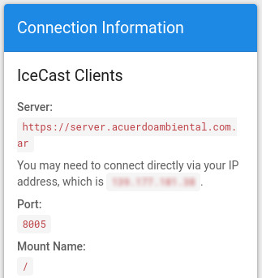
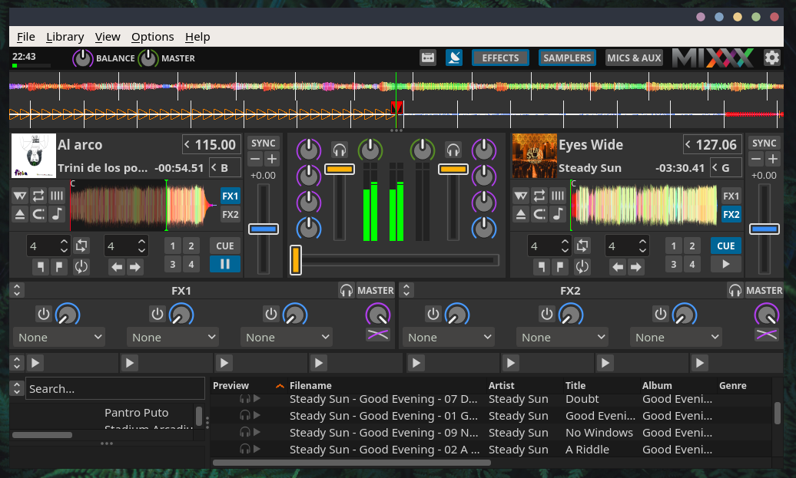
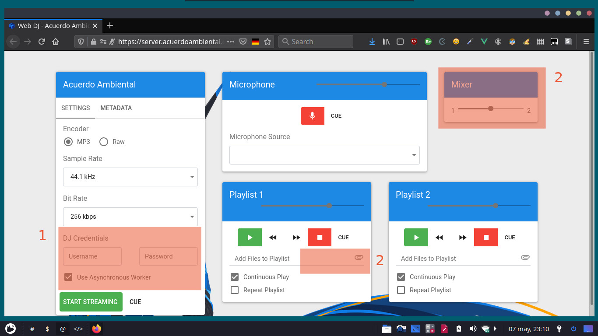
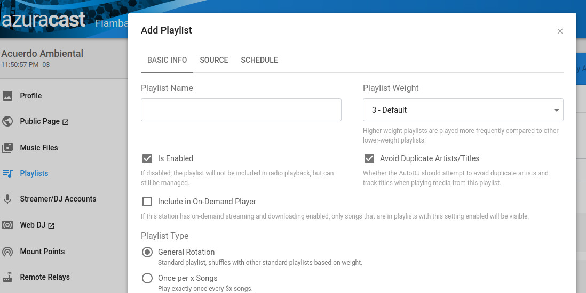

## Cómo ser un Dj de radio online usando AzuraCast

Ahora podés sonar en radios online muy fácilmente con un servidor AzuraCast. Podés transmitir tus canciones y audios desde cualquier lugar del mundo.

> Phillip Seymoure Hoffman interpreta a The Count, en Pirate Radio (2009).
>
> [Fuente de la imagen: imdb](https://www.imdb.com/title/tt1131729/?ref_=tt_ch)

Las opciones para ser dj en una radio hosteada con AzuraCast son las siguientes:

- Utilizar un programa propio de música (aquí mostramos Mixxx Dj)
- Usar el web dj integrado de AzuraCast
- Crear playlists, subirlas al servidor y sonar en horarios programados

La persona que sea admin de la radio debe generarte los accesos para 'broadcastear' tu programación radial.

Estos accesos suelen ser así:

Los datos principales:

- Server (ejemplo: server.turadio.com). Este dato NO vamos a usar.
- IP (ejemplo: 145.122.183.12)
- Puerto (8001)
- Punto de montaje o Mout Point (/)

Luego los ingresaremos en nuestro software de transmisión. Acá mencionamos Mixxx porque es libre y está disponible para todas las plataformas, pero se pueden usar múltiples programas [como indican en la documentación de Azura](https://docs.azuracast.com/en/user-guide/streaming-software) donde se mencionan otras opciones como Butt, RadioBoss y SamCast.

## Primer Método: Mixxx Dj

Una vez instalado Mixxx (a considerar que puede requerir añadir un encoder de audio, no en todos los casos es necesario, más info en [la documentación de Mixxx](https://github.com/mixxxdj/mixxx/wiki)). 

En las preferencias de Mixxx ingresaremos los datos de server (idealmente IP, 8005, /, ). Más información [en la página de Mixxx](https://mixxx.org/) y en la documentación de Azura mencionada anteriormente.

Si todos los datos son correctos vas a estar transmitiendo como Dj invitado, un administrador de servidor puede limitar los horarios en que puedas transmitir.

## Segundo Método: web DJ de AzuraCast

El web Dj de Azura nos permite transmitir desde una interfaz muy simple (por lo tanto con pocas opciones de personalización). Pero siguiendo el lema 'Menos es más' podemos concluir que en muchos casos es suficiente y facilita el acceso a más gente.

Los tres puntos a considerar en este panel:

1. Credenciales. Estas tienen que ser provistas por el admin del servidor.
2. Adjuntar archivos. Aquí vamos poniendo nuestra música o audios.
3. Mixer. Para cambiar entre un canal y otro.

El procedimiento es similar a la mayoría de los programas de operación radiofónica, pasamos de un canal a otro moviendo el mixer hacia la izquierda y la derecha. En este caso incluso podemos cargar una playlist en cada canal.

## Tercer Método: cargar playlist en Azura Cast Auto DJ

Debería hacer un post específico sobre esto, pero en resumen la idea es la siguiente:

Nuestro admin nos crea un usuario sftp (un protocolo de transferencia de archivos similar al FTP). Y con un programa llamado FileZilla subiremos los archivos al servidor. Luego con un usuario de AzuraCast podemos crear las playlist e incluso elegir horarios en los que suena cada lista de reproducción. Pero eso sería para verlo en profundidad en otro post.

